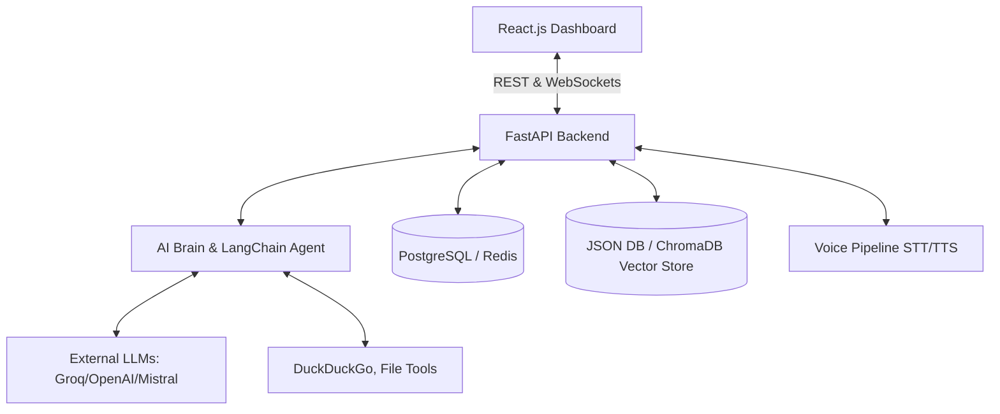

# 

<div align="center">

**Enterprise-Grade Voice-Activated AI Assistant with RAG, Vector Memory & Kubernetes Deployment**

[](https://python.org)
[](https://react.dev)
[](https://fastapi.tiangolo.com)
[](https://www.docker.com/)
[](https://kubernetes.io/)
[](LICENSE)

<br />

[Features](#-features) · [Architecture](#-architecture) · [Quick Start](#-quick-start) · [Deployment](#-deployment) · [Contributing](#-contributing)

</div>

---

## ✨ Features

- 🧠 **RAG Pipeline**: Retrieval-Augmented Generation with advanced vector memory context.
- 🗄️ **Persistent Vector Memory**: Semantic search across all conversations (ChromaDB).
- ⚡ **Real-time Streaming**: Token-by-token LLM streaming via WebSockets.
- 🎨 **React Dashboard**: Modern dark-themed UI with chat, knowledge base, system status, and a **new Read Aloud** (Text-to-Speech) feature.
- 🌐 **Enterprise FastAPI Backend**: Robust REST + WebSocket APIs with CORS, rate limiting, and robust error handling.
- 🎤 **Voice Interface**: Continuous listening (VAD) → STT (Whisper/SpeechBrain) → TTS pipeline.
- � **Cloud-Native Deployment**: Full Docker Compose setup and Kubernetes manifests (Deployments, Services, HPA, Ingress).
- � **CI/CD Pipeline**: GitHub Actions workflows for automated testing and Kubernetes deployment.
- 💬 **Multi-LLM Support**: Groq, OpenAI, Mistral — seamless switching via config.
- 🌍 **Bilingual & Dynamic Modes**: Strict English/Hindi support, Deep Research Mode, and Fast Mode.

## 🏗️ Architecture



## 🚀 Quick Start

### Prerequisites

- Python 3.8+
- Node.js 18+
- Docker & Docker Compose (for enterprise setup)
- LLM API Key (e.g., [Groq](https://console.groq.com/))

### 1. Clone & Configure

```bash
git clone https://github.com/devs2332/my_jarvis_in_testing.git
cd my_jarvis_in_testing

# Set up environment variables
cp .env.example .env
```
Add your API keys to the `.env` file (e.g., `GROQ_API_KEY`).

### 2. Run Locally (Docker Compose - Recommended)

We provide a fully containerized development environment:

```bash
docker-compose -f deploy/docker/docker-compose.yml up -d --build
```
This will spin up the database (PostgreSQL), Redis, Backend (FastAPI), and Frontend (React/Vite).
Access the dashboard at **http://localhost:5173**.

### 3. Run Locally (Manual)

If you prefer running services outside of Docker:

**Terminal 1: Backend**
```bash
python -m pip install -r requirements.txt
python -m uvicorn backend.app.main:app --reload --port 8000
```

**Terminal 2: Frontend**
```bash
cd frontend
npm install
npm run dev
```

**Terminal 3: Voice CLI (Optional)**
```bash
python main.py
```

## 📁 Project Structure

```text
jarvis-ai/
├── backend/                # Enterprise FastAPI backend (REST, WebSockets, Agents)
├── frontend/               # React.js web dashboard
├── database/               # JSON Memory and DB persistence mechanisms
├── deploy/                 # Docker Compose & Kubernetes manifests
├── configuration/          # Configuration definitions and settings scripts
├── .github/workflows/      # Automated CI/CD (GitHub Actions pipelines)
├── docs/                   # Documentation and architecture guides
├── pretrained_models/      # Local model binaries and configurations
├── LICENSE                 # MIT License file
└── requirements.txt        # Python backend dependencies
```

## � Enterprise Deployment

### Kubernetes (K8s)

The `deploy/kubernetes` folder contains production-ready manifests:
- ConfigMaps and Secrets management
- Deployments & Services
- Horizontal Pod Autoscaler (HPA)
- Ingress configuration

Deployment is fully automated via the **GitHub Actions CI/CD Pipeline**. Ensure the `KUBE_CONFIG` secret and the target deployment environments (e.g., `production`) are configured in your repository settings.

## 🐛 Troubleshooting

- **"No API key found"**: Verify your `.env` file and `config.py` settings.
- **Database Connection Errors**: Ensure files in the `database/` directory (like `memory.json`) have correct permissions or ensure your Postgres container is up.
- **Rate Limit or WebSocket Drops**: Check your API provider's usage limits. The system status page on the dashboard helps monitor connections.
- **Microphone / Audio Issues**: The system auto-detects sample rates. Run `python backend/installer/doctor.py` or equivalent diagnostic scripts to check audio devices.

## 🔐 Privacy & Security

- 🏠 Voice processing happens locally (Whisper).
- 💾 Vector memory is stored locally in ChromaDB.
- � API credentials are strictly managed via `.env` and K8s Secrets.
- 🚫 Zero unwanted telemetry or tracking.

## 🤝 Contributing

Contributions are always welcome! Check out our [CONTRIBUTING.md](CONTRIBUTING.md) for guidelines.
Please ensure all tests and linting (`ruff`) pass before opening a Pull Request.

1. Fork the repository
2. Create a feature branch (`git checkout -b feature/amazing-feature`)
3. Commit changes (`git commit -m 'Add amazing feature'`)
4. Push to branch (`git push origin feature/amazing-feature`)
5. Open a Pull Request

## 📄 License

This project is licensed under the MIT License — see the [LICENSE](LICENSE) file for details.

---
<div align="center">
<b>Built with ❤️ | Inspired by JARVIS from Iron Man</b><br>
⭐ Star this repo if you find it useful!
</div>
