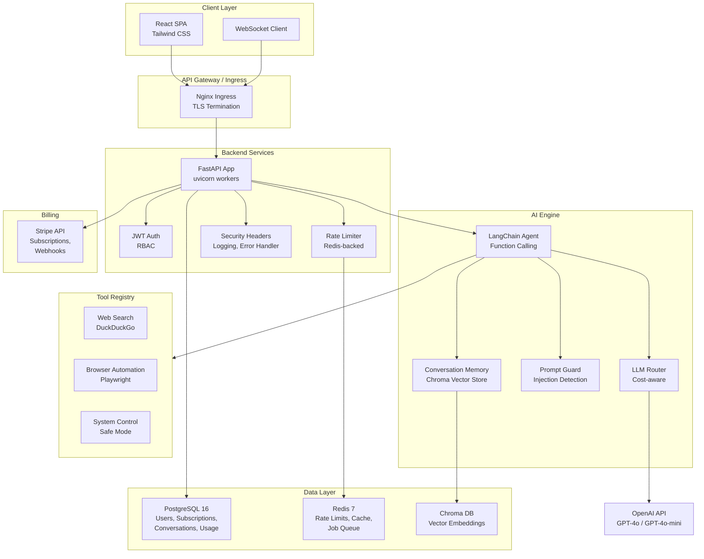

# Enterprise Jarvis AI Platform — Architecture

## System Architecture

## Component Overview

| Component | Technology | Purpose |
|-----------|-----------|---------|
| API Server | FastAPI + uvicorn | Async REST + WebSocket API |
| Authentication | JWT + bcrypt | Access/refresh tokens, RBAC |
| AI Agent | LangChain + OpenAI | Structured tool-calling agent |
| LLM Router | Custom | Cost-aware model selection by plan |
| Rate Limiter | Redis sorted sets | Sliding window per-user limits |
| Database | PostgreSQL 16 | Persistent storage (users, billing, chats) |
| Cache | Redis 7 | Response cache, rate limits, job queue |
| Vector Store | Chroma DB | Per-user conversation memory |
| Frontend | React 18 + Tailwind | SPA with streaming chat UI |
| Billing | Stripe | Subscription management |
| Container | Docker | Multi-stage production images |
| Orchestration | Kubernetes | Autoscaling, rolling deploys |
| CI/CD | GitHub Actions | Lint → Test → Build → Deploy |

## Security Architecture

- **Authentication**: JWT (access + refresh tokens) with bcrypt password hashing
- **Authorization**: Role-based (user, admin, enterprise) at API and tool level
- **Rate Limiting**: Redis-backed sliding window, plan-aware limits
- **Input Protection**: Prompt injection detection + sanitization
- **Tool Safety**: Command whitelisting, execution confirmation
- **Transport**: TLS termination at ingress, HSTS enforcement
- **Headers**: CSP, X-Frame-Options, X-Content-Type-Options, Referrer-Policy
- **Secrets**: K8s Secrets, env-based config, no hardcoded credentials
- **Audit**: Structured JSON audit logging for security events

## Data Flow

1. **Request** → Nginx Ingress → FastAPI middleware stack
2. **Auth** → JWT validation → User lookup → Plan resolution
3. **Rate Check** → Redis sliding window → Accept/Reject
4. **Chat** → Prompt Guard → LLM Router (plan→model) → LangChain Agent
5. **Agent** → Tool selection → Execute → Stream tokens via WebSocket
6. **Persist** → Save message + token usage to PostgreSQL
7. **Memory** → Store embeddings in Chroma for context retrieval
